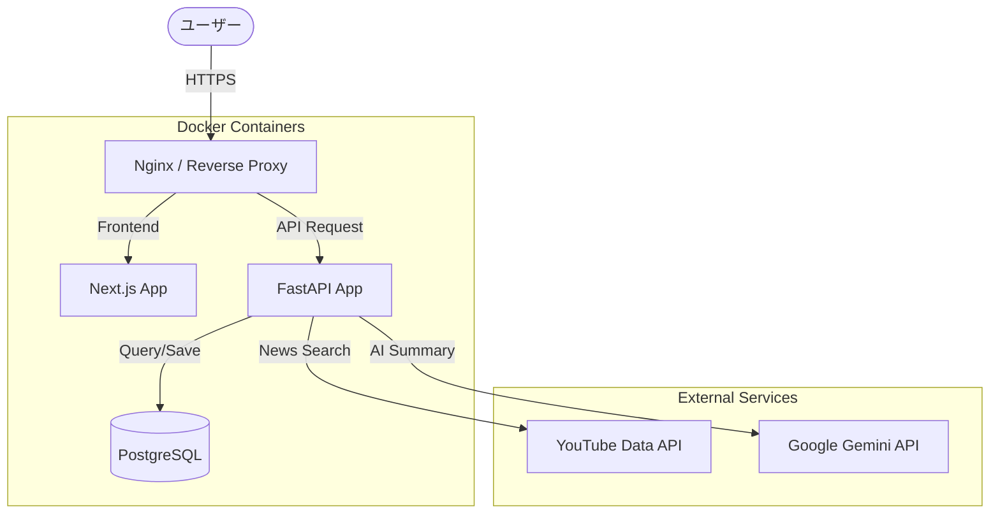

# News Check

**毎日のニュースチェックを、もっとスマートに。**

News Checkは、YouTube上のニュース動画を自動収集・要約し、短時間で効率的に情報をキャッチアップできるWebサービスです。
AI (Gemini) がニュースの要点を構造化して提示するため、動画を全編視聴することなく、重要なトピックを素早く把握できます。

## ✨ 特徴

* **完全自動化**: 毎日決まった時間にYouTube (ANNnewsCH) からニュース動画を自動収集。
* **AI要約**: Gemini APIを活用し、動画の内容を「タイトル」「重要ポイント」「詳細」に構造化して要約。
* **効率的なUI**: クリーンでモダンなデザインのダッシュボードで、その日のニュースを一目で確認。
* **動画視聴もスムーズ**: 気になるニュースは、埋め込みプレーヤーでその場で視聴可能。

## 🛠 技術スタック

本プロジェクトは、モダンなWeb技術とクラウドインフラを組み合わせて構築されています。

* **Frontend**: [Next.js](https://nextjs.org/) (React)
  * UI Library: Tailwind CSS (一部), Custom CSS modules
* **Backend**: [Python](https://www.python.org/) ([FastAPI](https://fastapi.tiangolo.com/))
  * Scheduler: APScheduler
* **Database**: [PostgreSQL 16](https://www.postgresql.org/)
* **AI Model**: Google Gemini API
* **External API**: YouTube Data API v3
* **Infrastructure**: Oracle Cloud Infrastructure (OCI) Always Free (ARM Architecture)
* **IaC / Configuration**: Terraform, Ansible
* **Containerization**: Docker, Docker Compose

## 🏗 システムアーキテクチャ



## 🚀 環境構築 (Local Development)

ローカル環境でアプリケーションを起動するための手順です。

### 前提条件

* Docker Desktop (または Docker Engine + Docker Compose)
* Git

### セットアップ手順

1. **リポジトリのクローン**

    ```bash
    git clone https://github.com/Seiya-Nakagawa/news_check.git
    cd news_check
    ```

2. **環境変数の設定**

    プロジェクトルートに `.env` ファイルを作成し、必要な設定を記述します。
    `.env.example` があればそれをコピーして使用してください。

    ```bash
    cp .env.example .env
    ```

    **主な設定項目:**
    * `GEMINI_API_KEY`: Google Gemini APIキー
    * `YOUTUBE_API_KEY`: YouTube Data APIキー
    * `POSTGRES_USER` / `POSTGRES_PASSWORD`: データベース接続情報

3. **コンテナのビルドと起動**

    ```bash
    docker compose up -d --build
    ```

4. **動作確認**

    ブラウザで以下のURLにアクセスして確認します。
    * **Frontend**: [http://localhost:3000](http://localhost:3000)
    * **Backend API Docs**: [http://localhost:8000/docs](http://localhost:8000/docs)

5. **ニュース手動収集 (Manual Extraction)**

    定期実行を待たずに、直ちにニュースを収集・要約したい場合は以下のコマンドを実行してください。

    ```bash
    curl -X POST http://localhost:8000/api/news/collect
    ```

    成功すると、処理結果 (処理件数など) がJSON形式で返却されます。

## 📂 プロジェクト構成

```text
.
├── backend/        # Python FastAPI アプリケーション (API, バッチ処理)
├── frontend/       # Next.js フロントエンドアプリケーション
├── terraform/      # インフラ構築 (OCI/Terraform)
├── ansible/        # 構成管理 (Ansible)
├── k8s/            # Kubernetes マニフェスト
├── nginx/          # Nginx 設定
├── docs/           # 設計書・ドキュメント (DESIGN.md, REQUIREMENTS.md)
└── docker-compose.yml
```

## 📝 ドキュメント

プロジェクトの詳細な仕様については、`docs/` ディレクトリ内の以下のファイルを参照してください。

* [**REQUIREMENTS.md**](docs/REQUIREMENTS.md): 要件定義書
* [**DESIGN.md**](docs/DESIGN.md): 基本設計書、システム構成図

## 📜 License

[MIT License](LICENSE)
