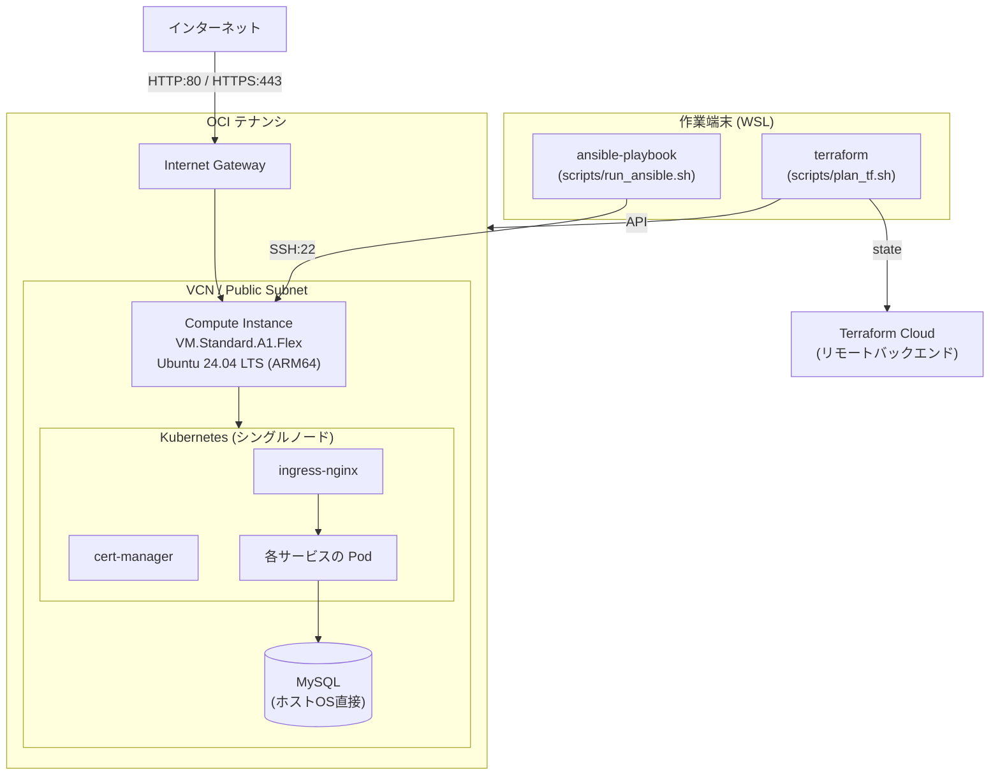

# 基本設計書 - OCI 個人開発基盤

## 1. システム構成

### 1.1. 前提インフラ

OCI（Oracle Cloud Infrastructure）の Always Free 枠を利用する。
インターネットから Internet Gateway を経由してアクセス可能な Public Subnet 内に、
Compute インスタンスを単一構成で配置する。

インフラのライフサイクルは 2 層に分かれ、それぞれ別のツールで管理する。

| 層 | 管理ツール | 管理対象 | ディレクトリ |
| -- | ---------- | -------- | ------------ |
| インフラ層 | Terraform | VCN、サブネット、セキュリティ・リスト、Compute インスタンス | `terraform/` |
| 構成管理層 | Ansible | OS 設定、Kubernetes、MySQL | `ansible/` |

### 1.2. 構成図

## 2. 技術スタック

### 2.1. バージョン確定方針

- OS は長期サポート版の LTS を採用し、Always Free 枠の ARM シェイプで動作するものを選定する
- Kubernetes は `apt` のパッケージバージョンを固定（pin）し、意図しないアップグレードを防ぐ
- Terraform Provider はメジャーバージョンを固定し、マイナーバージョンの更新のみ許容する

### 2.2. 採用ライブラリ

| 分類 | 製品・ライブラリ | バージョン |
| ---- | ---------------- | ---------- |
| OS | Ubuntu | 24.04 LTS (ARM64) |
| IaC | Terraform | 1.0.0 以上 |
| Terraform Provider | `oracle/oci` | 5.x |
| 構成管理 | Ansible | 2.15 以上 |
| コンテナランタイム | containerd | Ubuntu 24.04 の apt 提供版 |
| コンテナオーケストレーション | Kubernetes | 1.30 |
| Ingress Controller | ingress-nginx | controller-v1.10.1 |
| 証明書管理 | cert-manager | v1.14.5 |
| データベース | MySQL | Ubuntu 24.04 の apt 提供版 |

Terraform の state は Terraform Cloud の Workspace `infra-oci-terraform` で管理する
（CLI-driven workflow）。設定手順は [TERRAFORM_CLOUD_SETUP.md](../../TERRAFORM_CLOUD_SETUP.md) を参照する。

## 3. 機能設計

[要件定義書 4章](../01.要件定義/要件定義書.md#4-機能要件)の各機能を、以下の方式で実現する。

| 要件 | 実現方式 |
| ---- | -------- |
| インフラのプロビジョニング | `terraform/` の各 `.tf` で OCI リソースを定義し、cloud-init（`terraform/cloud-init.yaml`）で初期設定を行う |
| OS 全般設定 | Ansible Role `os`（[OS設計書](OS設計書.md)） |
| Kubernetes 環境構築 | Ansible Role `kubernetes`（[Kubernetes設計書](Kubernetes設計書.md)） |
| データベース管理 | Ansible Role `mysql`（[MySQL設計書](MySQL設計書.md)） |

`ansible/site.yml` は `os` → `kubernetes` → `mysql` の順に Role を適用する。
Role 単位で適用する場合は同名のタグ（`--tags os` 等）を使用する。

### 3.1. ネットワーク (VCN)

- **VCN / サブネット**: Public Subnet × 1 構成
- **ルーティング**: デフォルトルート（`0.0.0.0/0`）を Internet Gateway に向ける
- **セキュリティリスト（ファイアウォール）**:
  - **Ingress（受信）**: TCP 80 (HTTP)、TCP 443 (HTTPS)、ICMP (Ping)、TCP 22 (SSH)。SSH は `allowed_client_cidr` で許可した IP からのみ
  - **Egress（送信）**: すべてのトラフィック（`0.0.0.0/0`）を許可

### 3.2. コンピュート (Compute Instance)

- **シェイプ**: `VM.Standard.A1.Flex`（ARM64、4 OCPU、24 GB RAM）
- **OS イメージ**: Ubuntu 24.04 LTS (ARM64)
- **ストレージ (Boot Volume)**: 200 GB（Always Free 枠の最大値）
- **ネットワーク**: Public Subnet に配置し、パブリック IP を自動割り当て
- **初期化設定 (cloud-init)**:
  - タイムゾーンを `Asia/Tokyo` に設定
  - 管理ユーザーを作成し、sudo 権限を付与
  - SSH 公開鍵を `authorized_keys` に登録
- **Oracle Cloud Agent**: 標準プラグインを有効化（Bastion 用プラグインは無効化）

## 4. データベース設計

### 4.1. 共通方針

MySQL をホスト OS へ直接インストールし、サービスごとにスキーマを分離する。
文字コード・照合順序・接続制限などの詳細は [MySQL設計書](MySQL設計書.md) を参照する。

### 4.2. テーブル定義

テーブル定義は各アプリケーションのリポジトリで管理する（本リポジトリのスコープ外）。

## 5. 画面設計

該当なし（本リポジトリは画面を持たない）。

## 6. 外部インタフェース設計

| インタフェース | 内容 |
| -------------- | ---- |
| OCI API | Terraform Provider `oracle/oci` 経由でリソースを操作する。認証は API キー方式 |
| Terraform Cloud | リモートバックエンドとして state を管理する。`terraform login` のトークンで認証する |
| SSH | 作業端末から許可 IP 経由でインスタンスへ直接接続する（公開鍵認証） |
| Let's Encrypt | cert-manager の ClusterIssuer（ACME）経由でサーバ証明書を自動発行する |

## 7. 非機能要件の実現方式

[要件定義書 6章](../01.要件定義/要件定義書.md#6-非機能要件)に対応する実現方式を示す。

| 要件 | 実現方式 |
| ---- | -------- |
| 可用性 | 単一インスタンス構成。障害時は Terraform / Ansible で再構築して復旧する |
| 性能 | `VM.Standard.A1.Flex`（4 OCPU / 24 GB RAM）を割り当てる |
| セキュリティ | ネットワークアクセス制御は OCI セキュリティ・リストで一元管理し、OS レイヤーのパケットフィルタは使用しない（[OS設計書 4.2節](OS設計書.md#42-os内ファイアウォール)）。SSH は公開鍵認証のみ（[OS設計書](OS設計書.md) 6章） |
| バックアップ・リストア | 構成情報は本リポジトリのコードを正とし、環境の再構築でリストアする |
| 運用・保守 | Terraform / Ansible によるコード管理。サーバ作業の証跡は `docs/04.保守・運用/` に記録する |
| コスト | Always Free 枠の範囲内でリソースを構成する |
| 移植性・保守性 | Ansible を Role 単位に分割し、レイヤーごとに独立して適用できる構成とする |

## 8. 制約事項・前提条件

- 本構成は OCI Always Free 枠の制限事項（コンピュートリソース、ブロックボリューム容量など）に依存する
- Terraform 側でのインスタンス破棄（`destroy`）時は Boot Volume も併せて削除される
  （誤操作防止のため `prevent_destroy = true` を設定している）
