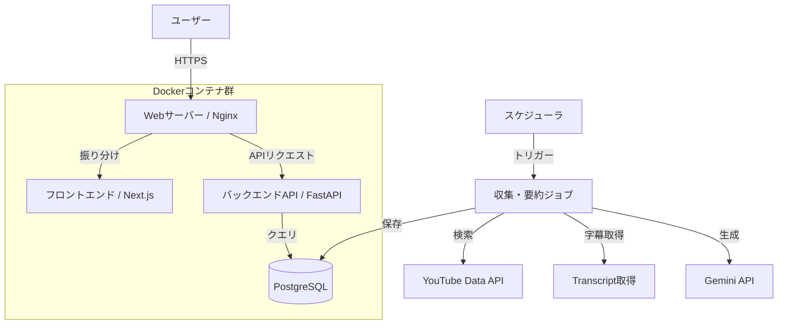
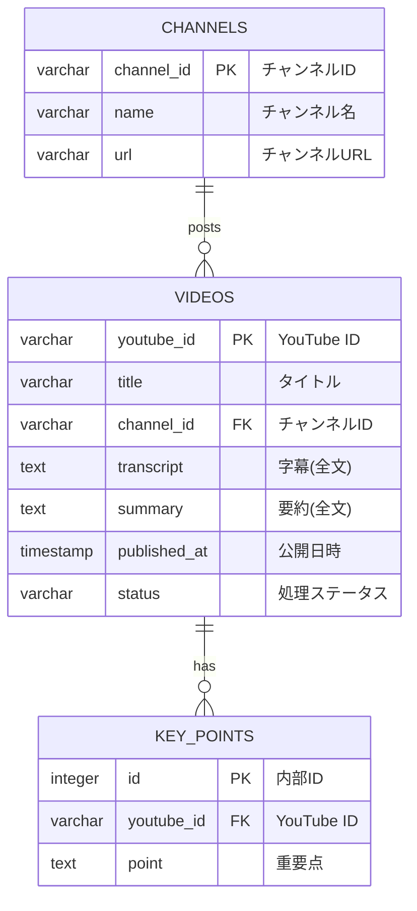

# 基本設計書: News Check

## 1. システム概要

本システム「News Check」は、YouTube上のニュース動画を自動収集・要約し、ユーザーが短時間で効率的に情報を摂取できるWebサービスです。
「完全自動化されたバックエンド処理」を特徴とします。

## 2. システムアーキテクチャ

システムは大きく分けて「フロントエンド（Web UI）」と「バックエンド（API・バッチ処理）」、「データベース」で構成されます。

### 2.1. システム構成

要件定義に基づき、コスト最適化および学習効果を最大化する技術スタックを以下のように選定しました。

* **インフラストラクチャ**:
  * **クラウドサービス**: **Oracle Cloud Infrastructure (Always Free)**
  * **インスタンスタイプ**: VM.Standard.A1.Flex (**4 OCPU, 24GB RAM**)
    * *選定理由*: 無料枠内で利用可能な最大スペックであり、リッチな検証環境として最適。
  * **OS**: Oracle Linux 9 または Ubuntu 22.04/24.04 LTS (ARM64)
* **アプリケーション構成 (Docker Compose)**:
  * **Webサーバー/リバースプロキシ**: **Nginx**
    * *選定理由*: 高速かつ軽量で、リバースプロキシとしての実績が豊富。静的ファイルの配信にも適しているため。
  * **フロントエンド**: **Next.js (React)**
    * *選定理由*: UIを実現するためのコンポーネント指向開発に適しており、SPA/SSRの柔軟な構築が可能であるため。
  * **バックエンドAPI**: **Python (FastAPI)**
    * *選定理由*: Gemini API等のAIライブラリが豊富なPythonを採用。中でもFastAPIは非同期処理に強く、型定義による堅牢な開発が可能なため。
  * **バッチ処理**: **Python (APScheduler等)**
    * *選定理由*: APIとコードベース（モデルやDB接続処理）を共有し、保守性を高めるため。APIサーバーとは別プロセス（コンテナ）として稼働させる。
  * **データベース**: **PostgreSQL 16** (Docker Container)
    * *選定理由*: 近年の標準的なRDBMSであり、JSON形式のデータ処理に優れるため。
  * **構成管理**: **Ansible**
    * *目的*: IaC (Infrastructure as Code) の実践。

### 2.2. データフロー概要



## 3. 機能設計

### 3.1. バックエンド機能

| コンポーネント | 機能名 | 詳細 |
| --- | --- | --- |
| **Collector** | 動画検索 | **ANNnewsCH** の動画リストから、タイトルが **"【ライブ】mm/dd"** に一致する動画を検索。 |
| | フィルタリング | 指定日付のアーカイブ動画（VOD）のみを対象とする。 |
| **Extractor** | 字幕取得 | 選定された動画の字幕データ（Transcript）を取得・整形する。 |
| **Summarizer** | AI要約 | Gemini APIを使用し、字幕テキストから構造化された要約（タイトル、重要ポイント、詳細）を生成。 |
| **API Server** | データ提供 | フロントエンドからのリクエストに対し、保存されたニュースデータ（動画情報＋要約）をJSON形式で返却。 |
| **Scheduler** | 定期実行 | 指定されたスケジュール（例: 毎朝7時）に収集・要約ジョブを起動。 |

### 3.2. フロントエンド機能 (UI)

* **デザインコンセプト**:
  * **Clean**: 余白を活かしたモダンなレイアウト。
  * **Glassmorphism**: 半透明な要素を用いた奥行きのあるデザイン。
  * **Responsive**: PC/タブレット/スマホに対応。

* **画面構成**:
  1. **Header (ヘッダー)**
      * **ロゴ**: アプリケーションロゴ。
      * **検索バー**: ニュースのタイトルや重要ポイントをリアルタイム検索（フィルタリング）。
  2. **Dashboard (メイン画面)**
      * **ヒーローセクション**: その日の最も重要なニュースを大きく表示。
      * **ニュースフィード**: カード形式でニュースを一覧表示。各カードにはサムネイル、タイトル、AI要約の要点（3行程度）を表示。
      * **アクション**: カードクリックで詳細モーダルを表示。
  3. **Detail View (詳細モーダル)**
      * YouTube埋め込みプレーヤー。
      * 全文要約（構造化されたテキスト）。
      * 関連リンク。

### 3.3. データベース設計

#### 3.3.1. ER図



#### 3.3.2. 具体的なデータ構造

##### 動画リスト

| YouTube ID | タイトル | チャンネルID | 字幕(全文) | 要約(全文) |
| :--- | :--- | :--- | :--- | :--- |
| vid001 | 今日のニュース | (省略) | (2万文字...) | (500文字...) |
| vid002 | 明日の天気 | (省略) | (1万文字...) | (300文字...) |

##### 重要点リスト

| YouTube ID | 重要点 |
| :--- | :--- |
| vid001 | 円安が進行 |
| vid001 | 輸出は好調 |
| vid001 | 株価上昇 |
| vid002 | 晴れ |
| vid002 | 気温上昇 |

##### チャンネル情報リスト

| チャンネルID | チャンネル名 | チャンネルURL |
| :--- | :--- | :--- |
| (UC...) | ANN | ann.com |
| (UC...) | TBS | tbs.co.jp |

#### 3.3.3. インデックス設計

パフォーマンス最適化のため、以下のカラムにインデックスを作成します。

| テーブル名 | カラム名 | 用途 |
| :--- | :--- | :--- |
| **VIDEOS** | `channel_id` | チャンネル情報との結合 (JOIN) 高速化 |
| **VIDEOS** | `published_at` | 日付指定でのニュース検索、ソート高速化 |
| **VIDEOS** | `status` | 未処理/処理済み動画のフィルタリング高速化 |
| **KEY_POINTS** | `youtube_id` | 動画情報との結合 (JOIN) 高速化 |

*注: 各テーブルの主キー (PK) には、RDBMSにより自動的にインデックスが作成されます。*

### 3.4. API設計 (簡易)

* **GET /news/daily/{date}**: 指定日のニュース一覧と要約を取得。
* **GET /news/video/{id}**: 特定の動画の詳細情報を取得。

## 4. 外部インターフェース

1. **YouTube Data API v3**
   * 用途: 動画の検索、メタデータ取得。
   * 制約: APIクォータ（1日あたりのリクエスト制限）に注意が必要。
2. **YouTube Transcript (非公式APIまたは代替手段)**
   * 用途: 動画の字幕データ取得。公式APIで取得できない場合はライブラリ等を使用。
3. **Google Gemini API**
   * 用途: テキスト要約、構造化。
   * モデル: `gemini-1.5-flash` (高速・低コスト) または `gemini-1.5-pro` (高精度) を想定。

## 5. 技術スタックまとめ

第2章で選定した技術スタックの一覧です。

* **Frontend**: **Next.js (React)**, HTML5, CSS3
* **Backend**: Python (FastAPI)
* **Database**: **PostgreSQL 16**
* **Infrastructure**: **Oracle Cloud (ARM)**
* **Tools**: **Ansible**, **Docker Compose**, **Nginx**

### 5.1. インフラ構築・運用フロー

Ansible と Docker を活用し、以下のフローで構築を行う。

1. **OCI インスタンス作成**: 手動またはTerraformでARMインスタンス(24GB RAM)を作成。
2. **プロビジョニング (Ansible)**:
    * Playbookを実行し、Docker環境とプロジェクトディレクトリ (`/opt/news-app`) を作成。
    * Ansible Vaultで暗号化された機密情報（DBパスワード、APIキー）を `.env` として展開。
3. **デプロイ (Docker Compose)**:
    * `docker-compose up -d` で3つのコンテナ (Nginx, API/FastAPI, DB/PostgreSQL) を起動。
    * データ領域はDocker Volume (`pg_data`) で永続化する。

## 6. 非機能要件への対応

* **NFR-01 (UI)**: ダークモードを基調とした配色と、Google Fonts (Inter/Noto Sans JP) の採用により見やすさを確保。
* **NFR-02 (Performance)**: フロントエンドのロード時間を短縮するため、画像は遅延読み込み(Lazy load)させる。APIレスポンスはキャッシュを検討。

## 7. ディレクトリ構成と自動化設計

本プロジェクトでは Infrastructure as Code (IaC) を全面的に採用し、構成管理とデプロイを自動化しています。`terraform` と `ansible` ディレクトリの設計意図を以下に示します。

### 7.1. Terraform (インフラ構築)

Oracle Cloud Infrastructure (OCI) のリソース管理を担当します。Always Free枠のARMインスタンスを最大限活用する構成です。

#### ディレクトリ構成 (`terraform/`)

*   **`main.tf`**: プロジェクト全体のプロバイダ設定や基本構成。
*   **`compute.tf`**: コンピュートインスタンス (VM.Standard.A1.Flex) の定義。
    *   *設計ポイント*: 4 OCPU, 24GB RAMの最大スペックを指定し、Cloud-initによる初期設定を紐づけ。
*   **`network.tf`**: VCN, Subnet, Internet Gateway, Security List等のネットワークリソース。
    *   *設計ポイント*: パブリックサブネットへの配置と、HTTP(80)/SSH(22)の許可設定。
*   **`cloud-init.yaml`**: インスタンス起動時の初期設定スクリプト。
    *   *役割*: 必要パッケージのインストール、ユーザー設定、タイムゾーン設定等。
*   **`variables.tf` / `outputs.tf`**: 変数定義と出力値の設定。
*   **`versions.tf`**: プロバイダのバージョン固定とTerraform Cloud設定。

### 7.2. Ansible (構成管理・デプロイ)

サーバー内部のミドルウェア設定、アプリケーションの配置、定期実行ジョブの管理を担当します。

#### ディレクトリ構成 (`ansible/`)

```
ansible/
├── ansible.cfg              # Ansible動作設定
├── inventory
│   └── hosts.yml            # 管理対象ホストの定義
├── playbook.yml             # 全体の実行フロー定義
└── roles                    # 役割ごとのタスク分割
    ├── common               # 共通設定 (タイムゾーン、基本パッケージ)
    ├── docker               # Docker環境の完全なセットアップ
    └── app_deploy           # アプリケーションのデプロイとCron設定
```

### 7.3. 定期実行アーキテクチャ (Host Cron)

ニュース収集ジョブの定期実行には、外部サービスではなく**Host Cron (サーバー内部のCron)** を採用しています。

*   **採用方式**: Linux標準の `cron` デーモン
*   **設定箇所**: `ansible/roles/app_deploy/tasks/main.yml` (Ansibleにより自動設定)
*   **実行コマンド**: `curl -s http://localhost:8000/api/news/collect`
*   **選定理由**:
    1.  **コスト**: OCIの外部トリガーサービスやスケジューラを利用する場合と異なり、完全無料かつ追加リソース不要。
    2.  **セキュリティ**: `localhost` へのリクエストで完結するため、APIエンドポイントを外部(インターネット)に公開して認証を設ける必要がない。VCN内部で閉じているため安全。
    3.  **シンプルさ**: サーバー内のログ (`/var/log/news_check/cron.log`) で実行結果を確認でき、運用が容易。
