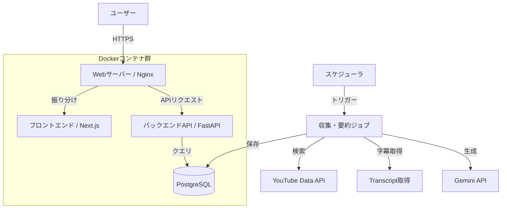
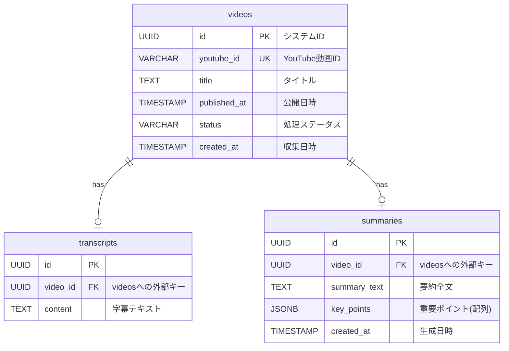

# 基本設計書: News Check

## 1. システム概要

本システム「News Check」は、YouTube上のニュース動画を自動収集・要約し、ユーザーが短時間で効率的に情報を摂取できるWebサービスです。
「完全自動化されたバックエンド処理」を特徴とします。

## 2. システムアーキテクチャ

システムは大きく分けて「フロントエンド（Web UI）」と「バックエンド（API・バッチ処理）」、「データベース」で構成されます。

### 2.1. システム構成

要件定義に基づき、コスト最適化および学習効果を最大化する技術スタックを以下のように選定しました。

* **インフラストラクチャ**:
  * **クラウドサービス**: **Oracle Cloud Infrastructure (Always Free)**
  * **インスタンスタイプ**: VM.Standard.A1.Flex (**4 OCPU, 24GB RAM**)
    * *選定理由*: 無料枠内で利用可能な最大スペックであり、リッチな検証環境として最適。
  * **OS**: Oracle Linux 9 または Ubuntu 22.04/24.04 LTS (ARM64)
* **アプリケーション構成 (Docker Compose)**:
  * **Webサーバー/リバースプロキシ**: **Nginx**
    * *選定理由*: 高速かつ軽量で、リバースプロキシとしての実績が豊富。静的ファイルの配信にも適しているため。
  * **フロントエンド**: **Next.js (React)**
    * *選定理由*: UIを実現するためのコンポーネント指向開発に適しており、SPA/SSRの柔軟な構築が可能であるため。
  * **バックエンドAPI**: **Python (FastAPI)**
    * *選定理由*: Gemini API等のAIライブラリが豊富なPythonを採用。中でもFastAPIは非同期処理に強く、型定義による堅牢な開発が可能なため。
  * **バッチ処理**: **Python (APScheduler等)**
    * *選定理由*: APIとコードベース（モデルやDB接続処理）を共有し、保守性を高めるため。APIサーバーとは別プロセス（コンテナ）として稼働させる。
  * **データベース**: **PostgreSQL 16** (Docker Container)
    * *選定理由*: 近年の標準的なRDBMSであり、JSON形式のデータ処理に優れるため。
  * **構成管理**: **Ansible**
    * *目的*: IaC (Infrastructure as Code) の実践。

### 2.2. データフロー概要

## 3. 機能設計

### 3.1. バックエンド機能

| コンポーネント | 機能名 | 詳細 |
| --- | --- | --- |
| **Collector** | 動画検索 | **ANNnewsCH** の動画リストから、タイトルが **"【ライブ】mm/dd"** に一致する動画を検索。 |
| | フィルタリング | 指定日付のアーカイブ動画（VOD）のみを対象とする。 |
| **Extractor** | 字幕取得 | 選定された動画の字幕データ（Transcript）を取得・整形する。 |
| **Summarizer** | AI要約 | Gemini APIを使用し、字幕テキストから構造化された要約（タイトル、重要ポイント、詳細）を生成。 |
| **API Server** | データ提供 | フロントエンドからのリクエストに対し、保存されたニュースデータ（動画情報＋要約）をJSON形式で返却。 |
| **Scheduler** | 定期実行 | 指定されたスケジュール（例: 毎朝7時）に収集・要約ジョブを起動。 |

### 3.2. フロントエンド機能 (UI)

* **デザインコンセプト**:
  * **Clean**: 余白を活かしたモダンなレイアウト。
  * **Glassmorphism**: 半透明な要素を用いた奥行きのあるデザイン。
  * **Responsive**: PC/タブレット/スマホに対応。

* **画面構成**:
  1. **Dashboard (メイン画面)**
  * **ヒーローセクション**: その日の最も重要なニュースを大きく表示。
  * **ニュースフィード**: カード形式でニュースを一覧表示。各カードにはサムネイル、タイトル、AI要約の要点（3行程度）を表示。
  * **アクション**: 「動画を見る」「詳細を読む」ボタン。
  2. **Detail View (詳細モーダル/ページ)**
  * YouTube埋め込みプレーヤー。
  * 全文要約（構造化されたテキスト）。
  * 関連リンク。
  3. **Settings (設定画面)**
  * 検索キーワード設定。
  * 除外設定。

### 3.3. データベース設計 (ER図・テーブル定義)

### 3.4. API設計 (簡易)

* **GET /news/daily/{date}**: 指定日のニュース一覧と要約を取得。
* **GET /news/video/{id}**: 特定の動画の詳細情報を取得。

## 4. 外部インターフェース

1. **YouTube Data API v3**
   * 用途: 動画の検索、メタデータ取得。
   * 制約: APIクォータ（1日あたりのリクエスト制限）に注意が必要。
2. **YouTube Transcript (非公式APIまたは代替手段)**
   * 用途: 動画の字幕データ取得。公式APIで取得できない場合はライブラリ等を使用。
3. **Google Gemini API**
   * 用途: テキスト要約、構造化。
   * モデル: `gemini-1.5-flash` (高速・低コスト) または `gemini-1.5-pro` (高精度) を想定。

## 5. 技術スタックまとめ

第2章で選定した技術スタックの一覧です。

* **Frontend**: **Next.js (React)**, HTML5, CSS3
* **Backend**: Python (FastAPI)
* **Database**: **PostgreSQL 16**
* **Infrastructure**: **Oracle Cloud (ARM)**
* **Tools**: **Ansible**, **Docker Compose**, **Nginx**

### 5.1. インフラ構築・運用フロー

Ansible と Docker を活用し、以下のフローで構築を行う。

1. **OCI インスタンス作成**: 手動またはTerraformでARMインスタンス(24GB RAM)を作成。
2. **プロビジョニング (Ansible)**:
    * Playbookを実行し、Docker環境とプロジェクトディレクトリ (`/opt/news-app`) を作成。
    * Ansible Vaultで暗号化された機密情報（DBパスワード、APIキー）を `.env` として展開。
3. **デプロイ (Docker Compose)**:
    * `docker-compose up -d` で3つのコンテナ (Nginx, API/FastAPI, DB/PostgreSQL) を起動。
    * データ領域はDocker Volume (`pg_data`) で永続化する。

## 6. 非機能要件への対応

* **NFR-01 (UI)**: ダークモードを基調とした配色と、Google Fonts (Inter/Noto Sans JP) の採用により見やすさを確保。
* **NFR-02 (Performance)**: フロントエンドのロード時間を短縮するため、画像は遅延読み込み(Lazy load)させる。APIレスポンスはキャッシュを検討。
